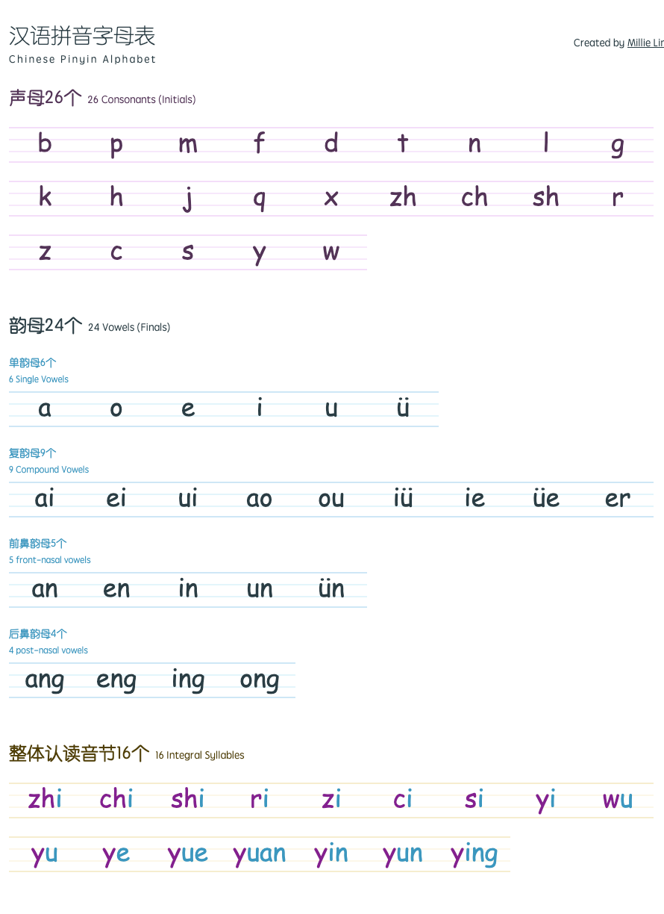

# 汉语拼音字母表 Chinese Pinyin Alphabet
A web version Pinyin Alphabet. Built in [Next.js](https://nextjs.org/) and [SASS](https://sass-lang.com/).

## Screenshot


## Get Started
```shell
npm install
npm run dev
```

## Production version
```shell
npm run build
npm run start
```